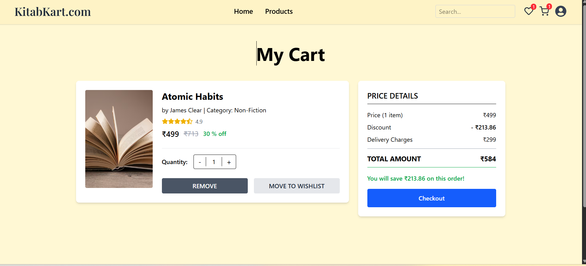

# 📚 BookNest — Frontend

A modern and responsive online bookstore UI that allows users to browse books, manage favorites, and place orders with an elegant and intuitive interface.

---

##  Live Link
> https://book-nest-app-plum.vercel.app/

---

## 🛠️ Tech Stack

| Technology | Description |
|-----------|------------|
| React (Vite) | Frontend Framework |
| Tailwind CSS | UI Styling |
| LocalStorage | Order summary and user data persistence |
| React Router | Navigation |
| Node.js + npm | Development environment |

---

## ⭐ Features

- 📚 Browse, search, and filter books
- 📄 View detailed book information
- ❤️ Add books to favourites & reading list
- 🛒 **Place orders**
- 💾 **Order summary stored in LocalStorage**
- 📱 Fully responsive (mobile + desktop)
- 🔐 API integrated with backend services

---

## 📸 Screenshots

### 🏠 Home Page


### 📚 Book Details Page


### 🛒 Order / Cart Page



## 📂 Folder Structure

```
BookNest-App/
├─ public/
│ └─ index.html
├─ src/
│ ├─ components/
│ ├─ pages/
│ ├─ assets/
│ ├─ styles/
│ ├─ App.jsx
│ └─ main.jsx
├─ .env
├─ package.json
├─ tailwind.config.js
├─ vite.config.js
└─ README.md

```


---

## 🔧 Installation & Setup

```bash
git clone https://github.com/Srushtik942/BookNest-App.git
cd BookNest-App
npm install
npm run dev
```

⚙️ Build for Production

npm run build

🔑 Environment Variables

VITE_API_BASE_URL=https://your-backend-url.com


